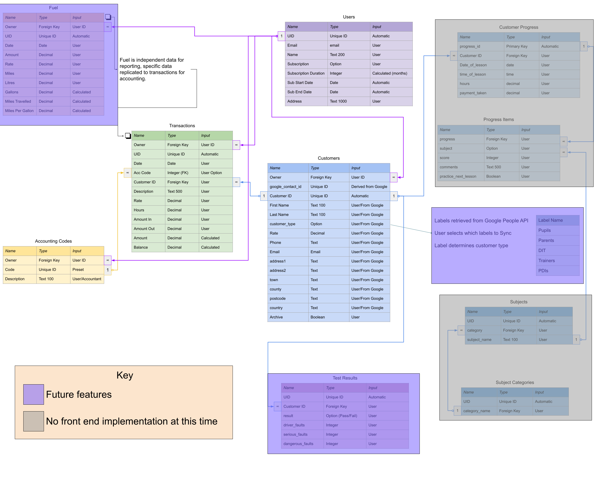

# ADI Assistant

## Introduction
ADI Assistant is a web based app designed to help Approved Driving Instructors (ADIs) and Potential Driving Instructors (PDIs) run their business.  This initial release has basic features to store customer information and record income and expenses as "Transactions".

There is potential for many more features beyond this initial site.

## Code Institute Milestone 4 Project

[The Live Website](https://ci-ms4-adi-assistant.herokuapp.com/)

## Table of Contents

---

1. [Project Goals](#project-goals)
2. [User Experience](#user-experience)
   1. [Target Audience](#target-audience)
   2. [User Stories](#user-stories)
3. [Scope](#scope)
    1. [Design](#design)
    2. [Typography](#typeography)
5. [Features](#features)
6. [Technologies Used](#technologies-used)
7. [Testing](#testing)
8. [Deployment](#deployment)
9. [Credits](#credits)
10. [Acknowledgements](#acknowledgements)

## Project Goals
The main goeals of this project are:

### Site Owner
* To provide a valuable tool for Driving Instructors to run their business more easily.
* To provide the tool on a subscription basis to help fund it's further development.
    * Adding customers will be available to non-subscribed users.
    * Adding transactions will only be available to users with a subscription.
### Site User
* To make storing and updating customer and financial information quick and easy.
* To be able to record information on the go without having to spend hours entering receipts.

    #### In Future
    * To integrate with feely available online calendering and contact services to leverage their capabilities without 'reinventing the wheel'.
    * To provide insight into pupils' performance based on their own progress record and test results.
    * Provide data based on the above that will highlight areas of developement for the ADI or PDI.
    * To provide a resource of publicly available information that ADI's and PDI's can contribute to based on their own experiences.

## Target Audience

* Approved Driving Instructors (ADIs)
* Potential Driving Instructors (PDIs)

## User Stories
As an ADI I want to be able to:

1. Easily sign up to the site so I can browse the features and decide if I want to subscribe.
2. Use my Google account to sign up to the site.
3. Add my customers(pupils) to the site.
4. Record financial transactions on the site and link them to a Customer where applicable.
5. Set my own accoutning code structure to record my transactions against for ease of producing financial records.

    In the future:
    * Import my contacts from Google Contacts
    * Download a list of my appointments(lessons) from Google Calendar, automatically link them to customers and add them to my Transactions as income.

As a PDI I want to be able to:

1. User all of the features of an ADI for free.

## Scope
Based on the goals of this project I have used Django to build this site.  It's database manangement structure and templating features, as well as the extensive extensions available, make this an ideal choice for building a dynamic web application with robust user authentication and payment features.

In development SQL Lite will be used for the database and in production Postgresql.

### Design
I have used the Bootstrap 5 framework with limited customisations.  

For a future release I will more greatly customise the colour scheme of the site to make it more unique.

#### **Database**
The database schema shows the various models used in the project as well as models not yet implemented with a view to future features.



### Typography
I have chosen the Quicksand font because I wanted something that is clear and easy to read, scales well and looks prefessional without being boring.


## Features

1. Sign up for an account manually.
2. Sign up for an account using Google.
3. Browse the site and create Customers without a subscription.
4. Subscribe to either a 12 month or month by month plan.
5. Add user own unique set of Accounting Codes in order to create financial transactions.
6. Add Transactions to record income and expenditure.
7. Manage subscription with an option to cancel.

## Technologies Used

### Languages
- [HTML5](https://en.wikipedia.org/wiki/CSS)
- [CSS3](https://en.wikipedia.org/wiki/CSS)
- [Javascript](https://en.wikipedia.org/wiki/JavaScript) (From W3C How To)
- [Python](https://www.python.org/)

### Frameworks, libraries and other tools
[Bootstrap Framework](https://getbootstrap.com/)

[Google Fonts](https://fonts.google.com/) Site fonts and icons

[VS Code](https://code.visualstudio.com/)

[git](https://git-scm.com/)

[GitHub](https://github.com/)

[Django](https://www.djangoproject.com/)

[django-allauth](https://django-allauth.readthedocs.io/en/latest/index.html)

[Heroku](https://heroku.com/)

[Stripe](https://stripe.com/gb)


## Testing

## Deployment

### Stripe
The following instructions are based on a subscription model.

1. Register for an account at stripe.com
2. Click on Developers in the top right of the navigation.
3. On the left, click on API keys
4. Copy the values of the publishable & secret keys
5. In your local environment(.env) and heroku, create environment variables STRIPE_TEST_PUBLIC_KEY, STRIPE_TEST_SECRET_KEY with the publishable and secret key values.

    Also include:
    ```
    STRIPE_LIVE_MODE =False
    STRIPE_LIVE_SECRET_KEY =pk_live_
    ```
---

There are several different applications that need to be configured to run this application locally or on a cloud based service like Heroku.

### Amazon WebServices
1. Create an account at aws.amazon.com.
1. Go to the AWS Management console under My Account.
1. Open the S3 application and create an S3 bucket named "ci-ms4-adi-assistant".
1. In the **Object Ownership** section ensure _**ACLs enabled**_ is selected and _**Bucked owner preferred**_.
1. Uncheck the "Block All Public access setting".
1. Acknowledge that the bucket will be public.
1. In the Properties section scroll down to **Static Website Hosting** and click edit.
1. Enable the setting and set the **index.html** and the **error.html** values to these generic values as they're not used.
    ```
    index.html
    error.html
    ```
1. In the Permissions section scroll down to the **CORS configuration** and paste in this configuration:
    ```
    [
        {
            "AllowedHeaders": [
                "Authorization"
            ],
            "AllowedMethods": [
                "GET"
            ],
            "AllowedOrigins": [
                "*"
            ],"ExposeHeaders": []
        }
    ]
    ```
1. From the top of this page find your ARN and copy it.
1. In the permissions section click edit on the bucket policy and set the following:
    ```
    Policy type: S3 Bucket
    Principal: *
    Actions: GetObject
    Amazon Resource Name (ARN): [paste what you copied above e.g. arn:aws:s3::: ...]
    ```
1. click Add Statement, then Generate Policy, copy this policy into the policy editor.
1. Add /* to the end of the **Resource:** value.
1. In the permissions section click edit on the Access control list(ACL)
1. tick the box next to **Everyone(public access)**
1. The bucket is created, the next step is to open the IAM application to set up access
1. Create a new user group named "ci-ms4-adi-assistant"
1. Add the **AmazonS3FullAccess** policy permission for the user group
1. Go to **Policies** and click "Create New Policy"
1. Click **Import Managed Policy**, search for S3 and import **AmazonS3FullAccess**
1. In the JSON editor, update the policy *Resource* to include your ARN:
    ```
    "Resource": [
        "arn:aws:s3::: ...",
        "arn:aws:s3::: .../*",
    ]
    ```
1. Click Review Policy, give it a name and description then click "Create Policy"
1. Go to Groups > Manage your group > Attach Policy > Search for the policy you just created > select it > click Attach Policy.
1. Go to Users click Add user
1. Set the username to something like **[your-project]-staticfiles-user**
1. Select "Programmatic access" for the access type, click next
1. Add the user to the user group ci-ms4-adi-assistant by ticking the box
1. Click through to the last page where you can click **Create user**
1. Download the CSV file that will give you the users AWS_SECRET_ACCESS_KEY and AWS_ACCESS_KEY_ID
    
    **!!!YOU WILL NOT BE ABLE TO DO THIS AGAIN SO MUST DO IT NOW**.

### Heroku
I have used Heroku to deploy this site.  If you would like to do the same follow these steps.
1. Within your project directory create a _.gitignore_ file & an _.env_ file
1. Install **decouple** `using pip3 install decouple`
2. Open _.env_ and enter following environment variables: 
    ```
    SECRET_KEY =...your secret key goes here...

    DEBUG =True

    STRIPE_TEST_PUBLIC_KEY =...your stripe public test key goes here...
    STRIPE_TEST_SECRET_KEY =...your stripe secrect key goes here...
    STRIPE_LIVE_MODE =False  # Change to True in production
    DJSTRIPE_WEBHOOK_SECRET =whsec_xxx
    STRIPE_LIVE_SECRET_KEY =sk_live_
    ```
3. Add _.env_ to the _.gitignore_ file so this senstive information is not pushed to Github
4. In a bash terminal type `pip3 freeze __local > requirements.txt`
5. Type `echo web: python app.py > Procfile` (note the capital P of Procfile)
6. Open the Procfile and remove any blank line from the bottom
7. `git add` then `git push` these files to your repository
8. Visit [heroku.com](https://www.heroku.com/) and sign in or sign up
9. Click the _New_ button > _Create new app_ in the top right
0. Enter a unique app name, this is unique to all of Heroku, not just your account
0. Select the region closest to you
0. Click _Create app_
0. Make sure you're on the Deploy tab and select GitHub from Deployment Method
0. Check that your GitHub account name is showing
0. Type part of the name of your repo to search and click _Search_
0. Click connect for the repo you want to connect
0. Select the Settings tab
0. Click _Reveal config vars_
0. Enter the config vars as set in your _.env_ file above
0. Ensure that your _Procfile_ and _requirements.txt_ files are committed and pushed to GitHub
0. Return to the Deploy tab
0. Enable automatic deployments
0. Select the branch (usually main) and click Deploy Branch
0. Once the app been deployed, click on the _Open app_ tab at the top right of the page.


### Forking the GitHub Repository
If you would like to fork this respository so you can make changes without affecting the original please follow these steps:

1. Log into your GitHub account and find the [repository](https://github.com/martinbannister/CI_MS4_ADI_Assistant).
2. Click 'Fork' (last button on the top right of the repository page).
3. You will then have a copy of the repository in your own GitHub account. 

### Making a Local Clone
In order to make a clone of this repository to work on locally, follow these steps:

1. Log into your GitHub account and find the [repository](https://github.com/martinbannister/CI_MS4_ADI_Assistant).
2. Click on the 'Code' button (next to 'Add file'). 
3. To clone the repository using HTTPS, under clone with HTTPS, copy the link.
   - For SSH, click the SSH tab and copy that link.
4. Then open Git Bash.
5. Change the current working directory to where you want the cloned directory to be made.
6. In your IDE's terminal type 'git clone' followed by the URL you copied.
7. Press Enter. 
8. Your local clone will now be made.

## Credits

📗Setting active state on links

[https://www.reddit.com/r/learnpython/comments/3hy3k5/pythonic_way_of_adding_classactive_to_navbar/](https://www.reddit.com/r/learnpython/comments/3hy3k5/pythonic_way_of_adding_classactive_to_navbar/)

📗Determining input type on Django form

[https://stackoverflow.com/questions/28877165/how-to-check-field-type-in-django-form](https://stackoverflow.com/questions/28877165/how-to-check-field-type-in-django-form)

📗Setting empty date field colour

[https://stackoverflow.com/questions/31706433/how-can-i-change-the-text-color-of-chromes-input-date-placeholder](https://stackoverflow.com/questions/31706433/how-can-i-change-the-text-color-of-chromes-input-date-placeholder)

📗Setting Django form to use browser date input

[https://youtu.be/I2-JYxnSiB0](https://youtu.be/I2-JYxnSiB0)

📗Setting up stripe for subscriptions

[https://ordinarycoders.com/blog/article/django-stripe-monthly-subscription](https://ordinarycoders.com/blog/article/django-stripe-monthly-subscription)

[https://testdriven.io/blog/django-stripe-subscriptions/](https://testdriven.io/blog/django-stripe-subscriptions/)

📗Getting social token from AllAuth for accessing Google account

[https://stackoverflow.com/questions/59040345/how-to-get-or-create-credentials-from-authenticated-user-in-django-allauth](https://stackoverflow.com/questions/59040345/how-to-get-or-create-credentials-from-authenticated-user-in-django-allauth)

[https://stackoverflow.com/questions/30888487/django-get-the-social-token-form-allauth](https://stackoverflow.com/questions/30888487/django-get-the-social-token-form-allauth)

📗Setting up Google authentication

[https://www.section.io/engineering-education/django-google-oauth/](https://www.section.io/engineering-education/django-google-oauth/)

## Acknowledgements