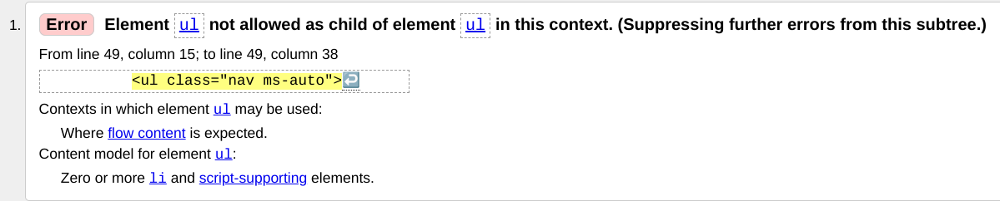
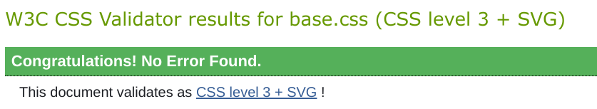
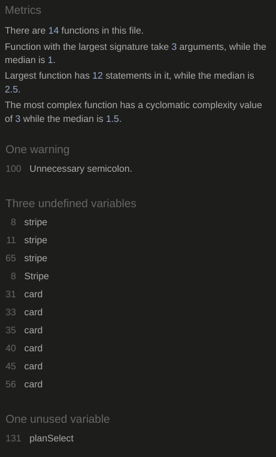

# ADI Assistant - Testing

[Return](../README.md) to We'll Look Into It README file.

## Table of Contents

- [HTML Validation](#HTML-Validation)
- [CSS Validation](#CSS-Validation)
- [Accessibility](#Accessibility)
- [Performance](#Performance)
- [JSHint testing](#JSHint-testing)

---

### HTML Validation

The author used the [W3C Markup Validation Service](https://validator.w3.org/) to validate the HTML the index, login and signup pages of the site.

This validation showed an error using a UL inside another UL but not in an li item.  I do not know how to fix this as this creates the acocunts drop down menu from bootstrap.

### CSS Validation

The author used the [W3C CSS Validation Service](http://jigsaw.w3.org/css-validator/validator) to validate the style.css file of the site.  It returned no errors.

### Accessibility

The author used the [WAVE WebAIM web accessibility evaluation tool](https://wave.webaim.org/report#/http://ci-ms3-we-ll-look-into-it.herokuapp.com/) to check if there were any issues with accessibility standards.  

### PEP8 Testing

The author used [PEP8 Online](http://pep8online.com/) to check the python code for any errors.  None were reported.

### JSHint testing

The author used [JSHint](https://jshint.com/) to verify the javascript used in the site.  

### User Testing

To save time a single video has been used to show the user testing in operation.

